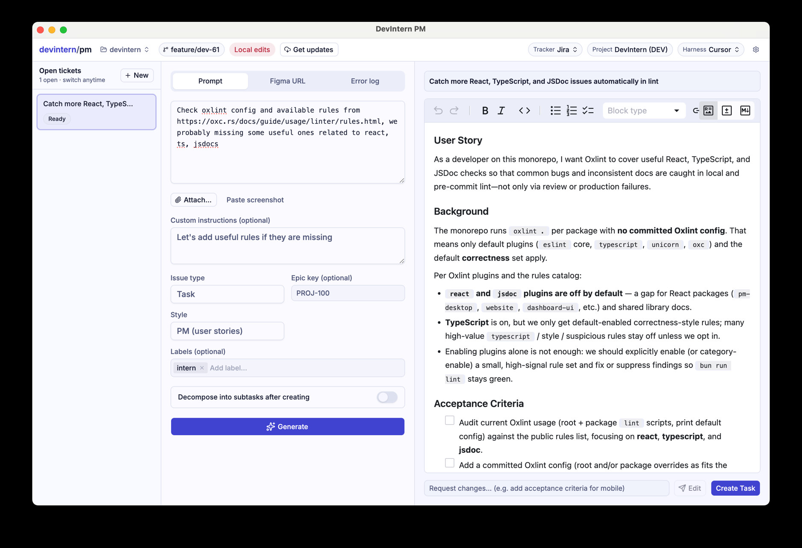

# DevIntern

<p align="center">
  <a href="https://devintern.com">
    
  </a>
</p>

<p align="center">
  <strong>Turn tracker tickets into pull requests with any coding agent — on your keys, self-hosted.</strong>
</p>

<p align="center">
  <a href="LICENSE.md"></a>
  <a href="https://devintern.com"></a>
  <a href="https://www.npmjs.com/package/@getdevintern/code"></a>
  <a href="https://github.com/getdevintern/devintern"></a>
</p>

<p align="center">
  <video src="https://github.com/user-attachments/assets/f62b17c0-4e5b-4a2f-ac3a-761c44af3680" width="100%" controls muted autoplay loop playsinline></video>
</p>
<p align="center"><em>Markdown task → coding agent → pull request</em></p>

<!-- Fallback GIF if video is awkward on some clients
<p align="center">
  
</p>
-->

DevIntern connects the tracker your team already uses to the coding agent and model you choose. Tickets get implemented and self-reviewed in the background; you step in when a clean diff is ready. Swap any piece at any time.

- **Your tracker:** Jira · Linear · GitHub Issues · Trello · Asana · Azure DevOps · plain markdown files
- **Your agent:** Claude Code · Codex · Cursor · OpenCode (one config line to switch)
- **Your keys:** BYOK — billed on your existing provider contract
- **Interactive use is free forever** — no signup, no time limit

<!-- Visual echo of the tracker + agent bullets above.
     Near-black brand marks use color/dark_mode_color so they stay visible
     under prefers-color-scheme (GitHub light + dark). -->
<p align="center">
  
  &nbsp;
  
  &nbsp;
  
  &nbsp;
  
  &nbsp;
  
  &nbsp;
  
  &nbsp;
  
  &nbsp;&nbsp;
  
  &nbsp;
  <picture>
    <source media="(prefers-color-scheme: dark)" srcset="https://api.iconify.design/simple-icons/openai.svg?color=%23ffffff" />
    
  </picture>
  &nbsp;
  
  &nbsp;
  
</p>

<p align="center">
  <a href="docs/code/quick-start.md"><strong>Docs</strong></a>
  ·
  <a href="https://www.npmjs.com/package/@getdevintern/code"><strong>npm</strong></a>
  ·
  <a href="https://devintern.com"><strong>Website</strong></a>
  ·
  <a href="https://devintern.com/pm-desktop/"><strong>PM desktop</strong></a>
  <!-- · <a href="YOUR-DISCORD-OR-DISCUSSIONS-URL"><strong>Community</strong></a> -->
</p>

## Quick start

```bash
# Requires Bun
curl -fsSL https://bun.sh/install | bash
bun install -g @getdevintern/code

# Zero tracker credentials: pass a local markdown task
devintern ./tasks/my-task.md --create-pr
```

That is the full loop: **markdown task → agent run → pull request**. No Jira or Linear account required for the markdown path.

With a real tracker (after `devintern init`):

```bash
devintern init                 # interactive setup for your tracker + agent
devintern PROJ-123 --create-pr
```

Product guides are available locally for [Code](docs/code/quick-start.md) and [PM](docs/pm/quick-start.md). The same guides are rendered at [devintern.com/docs](https://devintern.com/docs/code/quick-start/).

## Run it interactively

Use DevIntern on demand while you stay in control of what runs and when. Interactive use is free forever.

| Command                                                               | Outcome                                                                |
| --------------------------------------------------------------------- | ---------------------------------------------------------------------- |
| `devintern doctor`                                                    | Check the runtime, agent, tracker, authentication, and license setup   |
| `devintern PROJ-123 --create-pr`                                      | Turn one tracker ticket into an implemented, committed pull request    |
| `devintern ./tasks/feature.md --create-pr`                            | Run a local Markdown task with no tracker credentials                  |
| `devintern PROJ-123 --create-pr --auto-review`                        | Review and improve the generated diff before handing the PR to a human |
| `devintern --query "project = PROJ AND status = 'To Do'" --create-pr` | Process a selected batch; query syntax follows your configured tracker |
| `devintern address-review <pr-url>`                                   | Apply human review feedback, push the changes, and reply on the PR     |
| `devintern resolve-conflicts <pr-url>`                                | Bring a PR up to date and let the agent resolve merge conflicts safely |

See the [usage guide](docs/code/usage.md) for tracker-specific query examples and optional flags.

## Put routine engineering work on autopilot

Once the interactive loop fits your workflow, **worker mode** turns it into an always-on teammate running on your own infrastructure. Your team marks work ready; DevIntern picks it up, creates the PR, and keeps that PR moving while people focus on decisions and review.

```bash
devintern worker init       # guided setup for repositories and ready-work queries
devintern worker            # start the unattended worker
```

- **Drain ready queues automatically:** poll Jira, Linear, GitHub Issues, Trello, Asana, Azure DevOps, or Markdown tasks and route work across one or many repositories.
- **Close the review loop:** respond to requested changes and inline comments, update stale branches, and resolve conflicts without force-pushing.
- **Schedule recurring maintenance:** run focused prompts for dependency health, flaky-test triage, TODO sweeps, or other repeatable work—even without a tracker ticket.
- **Operate with confidence:** durable local queues survive restarts, repository-level concurrency prevents collisions, configurable sandboxing can limit agent access, and a local dashboard shows run history and outcomes.

Worker mode is additive: keep using free interactive commands whenever you want direct control, and add unattended automation where it saves the team time. It runs on a laptop, VM, or container and requires an automation license. See the [worker guide](docs/code/worker.md) for setup and examples.

## Why teams use it

| Capability                | What it does                                                                      |
| ------------------------- | --------------------------------------------------------------------------------- |
| **Ticket drafting**       | Desktop app turns a prompt, log, or Figma frame into a ticket before Code runs it |
| **Feasibility gate**      | Vague tickets get questions back on the tracker instead of a confidently wrong PR |
| **Self-review loop**      | The agent reviews and fixes its own diff before a human sees it                   |
| **Unattended automation** | Scheduled pickup; review comments become commits on the same branch               |
| **Real-world resilience** | Persistent queue, crash recovery, rate-limit pause/resume                         |

<!-- Optional: secondary visuals (feasibility comment on a ticket, self-review, worker dashboard)
<p align="center">
  
  
</p>
-->

Write the ticket first with **[DevIntern PM](https://devintern.com/pm-desktop/)** (desktop, free, no signup) or **[`@getdevintern/pm`](https://www.npmjs.com/package/@getdevintern/pm)** (`devpm`) in the terminal, then run it with `devintern`.

<p align="center">
  <a href="https://devintern.com/pm-desktop/">
    
  </a>
</p>
<p align="center"><em>Prompt → drafted ticket → Create Task</em></p>

## License and pricing

Source is under the [Functional Source License, Version 1.1, with Apache 2.0 Future License](LICENSE.md) (FSL-1.1-Apache-2.0). You can read it, audit it, self-build, and self-host. Each release converts to Apache-2.0 two years after publication.

- **Interactive use** → free forever
- **Unattended automation** (scheduled pickup, webhook-driven review handling) → Supporter License (one-time) or Team/Business subscription

Details: [devintern.com/pricing](https://devintern.com/pricing/)

The FSL grants no trademark rights: the DevIntern name and logo are trademarks of Daniil Pokrovsky (devintern.com) and may not be used to identify forks or derived products.

## Repository layout

| Package                                        | Purpose                                                          |
| ---------------------------------------------- | ---------------------------------------------------------------- |
| [`@getdevintern/code`](packages/code)          | The `devintern` CLI: ticket → agent → self-reviewed PR           |
| [`@getdevintern/pm`](packages/pm)              | The `devpm` CLI: rough input → well-specified tickets            |
| [`@devintern/pm-desktop`](packages/pm-desktop) | Desktop app for ticket drafting: prompt, log, or Figma → tracker |
| `packages/*` (shared)                          | Agent harness, tracker clients, auth, license check, utilities   |

Website and control plane live elsewhere; this repo is the tool packages.

## Development workflows

Install dependencies with `bun install`, then use the root commands below. Turborepo runs package tasks in parallel where it is safe and orders workspace builds according to their package dependencies.

| Command                | Purpose                                                                      |
| ---------------------- | ---------------------------------------------------------------------------- |
| `bun run build`        | Build every workspace and its dependencies                                   |
| `bun run test`         | Run all package test suites                                                   |
| `bun run lint`         | Lint all packages                                                            |
| `bun run typecheck`    | Type-check all packages                                                       |
| `bun run format:check` | Check formatting without changing files                                      |
| `bun run format`       | Format all packages; this write task is intentionally not cached              |
| `bun run dev`          | Start the dashboard and desktop watch tasks; stop them with <kbd>Ctrl+C</kbd> |

Package-level commands remain available, for example `bun run --filter @getdevintern/pm test`. To run a selected task and its dependency graph through Turborepo, use `bun run turbo run build --filter @getdevintern/code`.

Turborepo uses the local `.turbo` directory for its cache; remote caching is not configured. Add `--force` to a Turbo command to ignore cached results, or remove `.turbo` to clear the local cache completely. If a result looks stale, first rerun it with `--force`; changes to the lockfile, package sources, shared lint configuration, or declared build environment variables automatically invalidate affected entries.

## Contributing

PRs welcome — see [CONTRIBUTING.md](CONTRIBUTING.md). Monorepo layout and Bun-only tooling: [AGENTS.md](AGENTS.md).

Built for teams that want agents to close tickets, not just write code.
